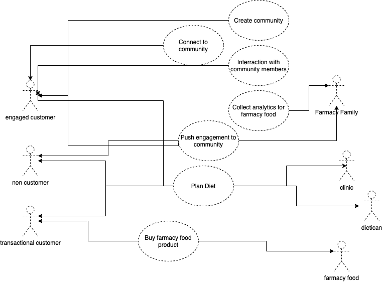

### Functional requirements overview and preanalysis

## Domain

## Data Model

## Core Use Cases

### Actors

1. Engaged Customer
1. Transactional Customer
1. Non Customer
1. Farmacy Family

### Use Case Scenarios

1. Create community
1. Connect to community
1. Interraction with community members
1. Push engagement to community
1. Buy farmacy food product
1. Collect analytics for farmacy food

[Back](README.md)