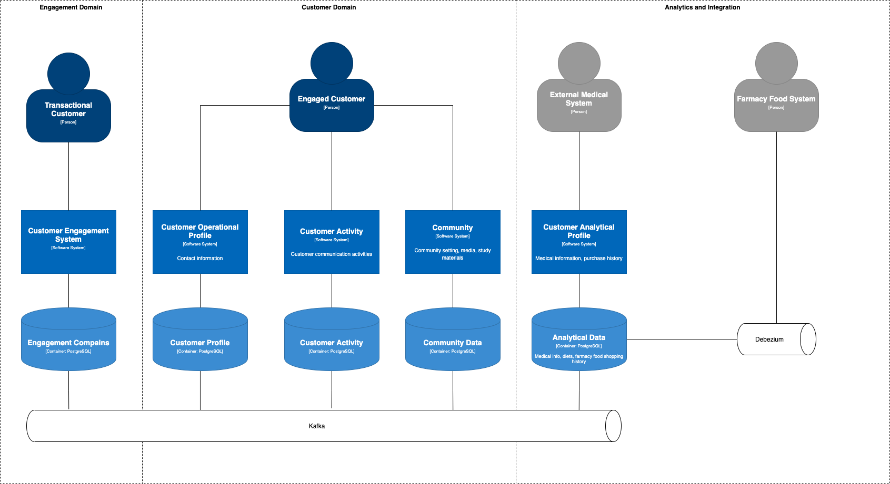
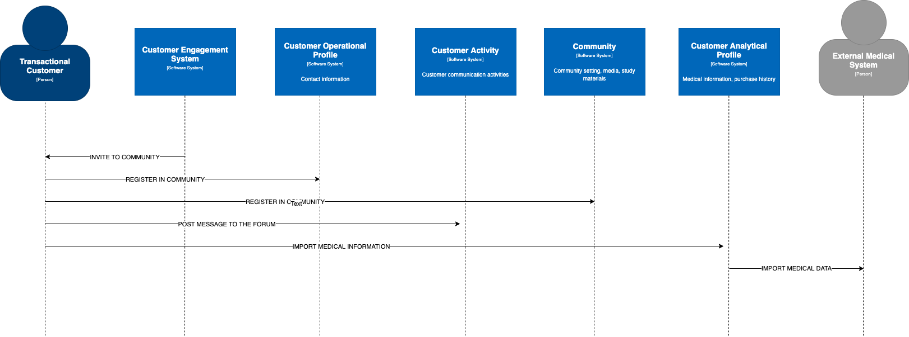

# Views and Perspectives

## Overall System Design

## Example Use Case

## System info

1. Customer Engagement System
    * Collect algorithm for customer engagement
    * Store data with customer segmentation 
    * Executes algorithm of engagment to community

1. Customer Operational Profile
    * Store information about customer nbame, address, accounts e.t.c
    * Provide information for customer segmentation

1. Customer Activity
    * Store information about customer activity (messages, forum post, notifications)
    * Show information in community

1. Community
    * Store information about community members
    * Store community related information, media files, study material

1. Customer Analytical Profile
    * Collect medical information
    * Track changes in customer health
    * Store customer centric analitics
    * Placed in separate security space

[Back](../README.md)