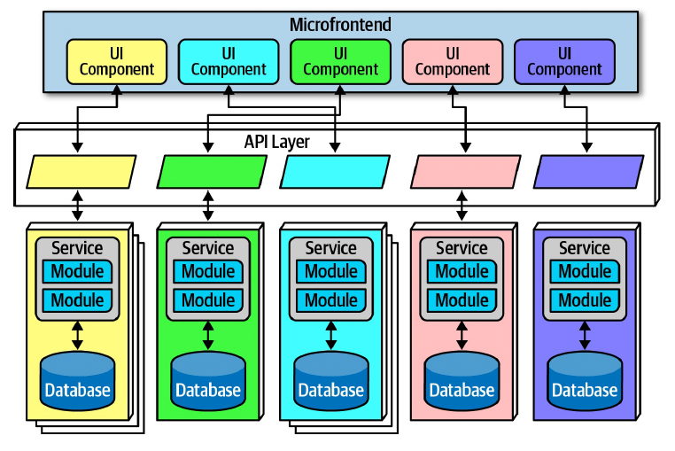

# Architecture Style

* Status: {accepted} <!-- optional -->
* Deciders: {Дмитрий Дзюба} <!-- optional -->
* Date: {2021-10-31} <!-- optional -->

## Context and Problem Statement

Need to select architecture style for application 

## Decision Drivers <!-- optional -->

* Application shiuld be very scalable
* Requirements can be decomposed to the set of services
* Solution is "customer facing" so we expect a lot of modification in client part

## Considered Options

1. Traditional monolit or microkernel application
1. Layered application with transactional services (classical SOA application)
1. Microservice application with micro frontends

## Decision Outcome

Chosen option: "Microservice application with micro frontends", because it is only type of application that support fast changes in logic (i.e. add new types of communication between community memebers) and can handle scalability requirements.

### Positive Consequences <!-- optional -->

* Good modifiability
* Good scalability
* Good elasticability

### Negative Consequences <!-- optional -->

* It's harder to create application and manage dependency

## Links <!-- optional -->

* [Microservices](https://martinfowler.com/articles/microservices.html)

[Back](README.md)