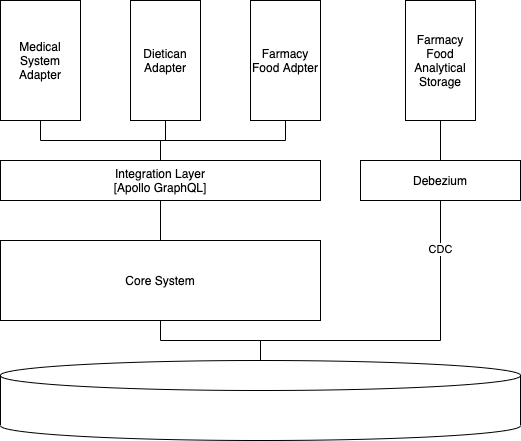

# Interaction with external systems

* Status: {accepted} <!-- optional -->
* Deciders: {Дмитрий Дзюба} <!-- optional -->
* Date: {2021-10-31} <!-- optional -->

## Context and Problem Statement

We need to integrate with various external systems:
* Medical systems
* Dietican systems
* Farmacy Food (for excange customer and analytics information)

## Decision Drivers <!-- optional -->

* We need to be able to add new integration fast

## Considered Options

* Create OpenAPI to allow all 4rd party integrate with Farmacy Family
* Create Adpater layer for integration
* Integrate with 3rd party in ad hoc

## Decision Outcome

Chosen option: "Create Adpater layer for integration", because it is most flexible way. Also we need to create internal API for integration between adapters and core system. It allow as to create new adapter faster. We need to support set of standart adapter (for example useing H7 medical excange standard)

It is better to use GraphQL for internal api layer. Becaue of flexibility in data selection.
For batch processinc of analitics it is better to use (Change Data Capture) solution like Debezium.

### Positive Consequences <!-- optional -->

* Isolation of adapters, fast adapter creation and modification

### Negative Consequences <!-- optional -->

* Additional "internal" integration layer will slow down communication (a bit)

## Links <!-- optional -->

* [H7 Standard](http://www.hl7.org/implement/standards/index.cfm)

[Back](README.md)