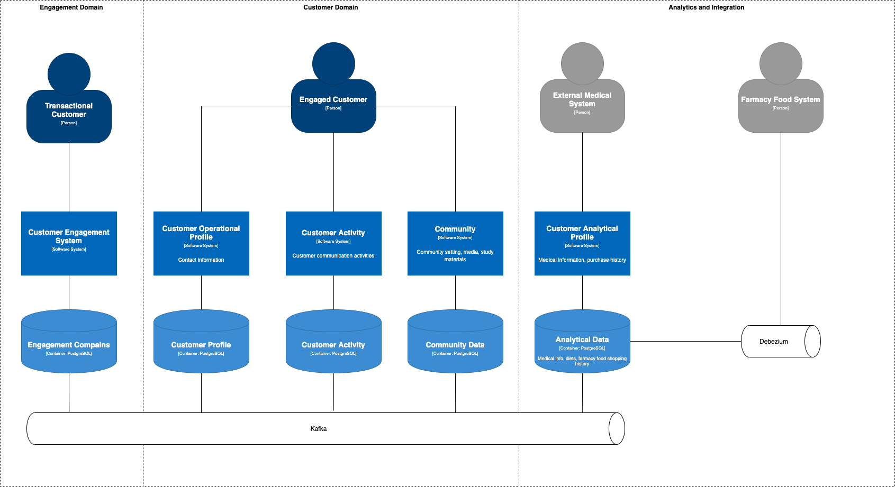

# System Decomposition

* Status: {accepted} <!-- optional -->
* Deciders: {Дмитрий Дзюба} <!-- optional -->
* Date: {2021-10-31} <!-- optional -->

## Context and Problem Statement

We need to separate application domain into the loosly coupled part. 

## Decision Drivers <!-- optional -->

To many domains will increase complexity in system creation and maintaince. To few domains incrise complexity in system modification.

## Considered Options

* One domain to rule them all
* Engagement, cutomer and analytics domain
* Engagement, Customer, Community, Medical, Learning, Media domain

## Decision Outcome

Chosen option: "Engagement, cutomer and analytics domain", because of good balance between system complexity and coupling.

### Positive Consequences <!-- optional -->

We can address requirments to the three domain%
* Engagement - all requirements for customer engagement and various loyality programs
* Customer - all requirements for customer community activity (forum, interactions, learning)
* Analytics and integration - all requirements for 3rd party integration

### Negative Consequences <!-- optional -->

We join integration and analytics domain and that may be add complexity to the various integration.

[Back](README.md)