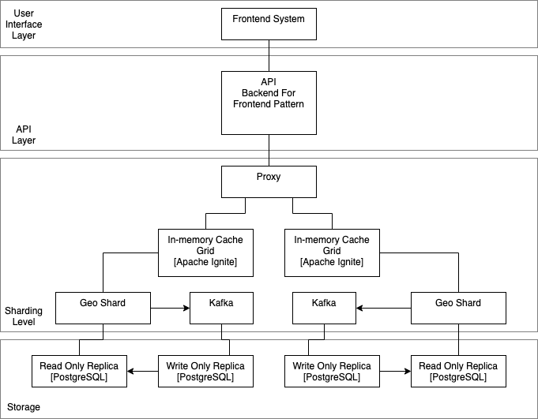
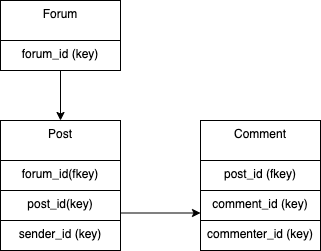
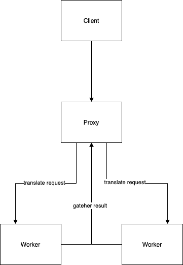
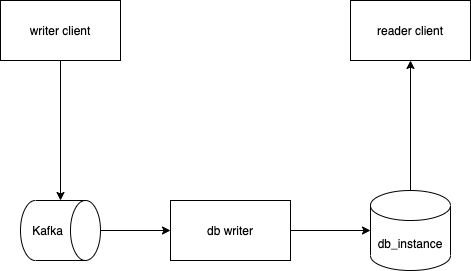

# Handle Scalability Requirement

* Status: {accepted} <!-- optional -->
* Deciders: {Дмитрий Дзюба} <!-- optional -->
* Date: {2021-10-31} <!-- optional -->

## Context and Problem Statement

We need to be able scale up system in case amound of engaged customers increase.

## Decision Drivers <!-- optional -->

* Customer can be connected localy by zone
* If we have celebrity as customer, we can catch Lady Gaga effect [LadyGagaInstagram](https://www.themoscowtimes.com/2019/07/18/russian-instagram-users-swarm-lady-gagas-page-over-bradley-cooper-a66469)

## Considered Options

* CQRS pattern for community domain
* Geographical Sharding according location zone
* Caching fmost sensitive data
* Event sourcing for asynchronius communication and better scalability

## Decision Outcome

We must consider all these options together. Social networks is very sensitive for performance.

### Data Indexing

The most amount of information we expect in forum messages, comments and direct messages. So we need to index these tables to speedup acess to data. The most perfect way is to create multi-column index because we need to fast search comments/messages by sender (to show him his personal messages); 

### Sharding

We need to speedup data access by creating geographical shards (for location based community). But, becase some one can have access to communities in different locations we need to use Scatter-and-Gatherer pattern.

### Caching

We need to cache  recently requeste data to speedup access. For example using read through pattern. As a cache grid we can use Apache Ignite.

### Replication

Another solution for speedup access is to use separate database instance for writing and reading of information. We can use one instance of PostgreSQL database to write, and multiple instances of read-only replicas (async repilcation). In social network the amount of reading request is greater then writing requests.

### Async writing

Also we need to use Comand Query Separation pattern for speed up changing in data. We can write data in Apache Kafka and then write it to database.

## Links <!-- optional -->

* [BackendForFrontend](https://samnewman.io/patterns/architectural/bff/)
* [ScatterAndGatherer](https://www.enterpriseintegrationpatterns.com/patterns/messaging/BroadcastAggregate.html)
* [CARS](https://martinfowler.com/bliki/CQRS.html)

[Back](README.md)